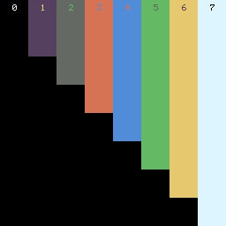

# Pixku

An 8 color environment for pixel art generation, built on top of Runt.

## Compilation

Compile all programs with `make`. This will make the pixku
binary.

To test if things are running okay, run `./pixku
testimage.lua`. This should produce a file called "out.png"
which should be identical to the image "pixku.png".

## Usage

Pixku is controlled via Lua, where there are 3 functions
defined.

The function `pixku.pt` will draw a pixel point at a
given XY location with a specified palette color. The
command `pixku.pt(1, 2, 3)` will draw a pixel at location
(1, 2) with color number 3. The default colors and their
numeric values can be seen in the test image "pixku.png".

The function `pixku.clr` will set the particular color
in the color palette. The command
`pixku.clr(0, 255, 128, 64)` will set color 0 to be the RGB
color (255, 128, 64).

The function `pixku.save` will save the contents to a PNG
file. The command `pixku.save("out.png")` will write to a
file called "out.png".